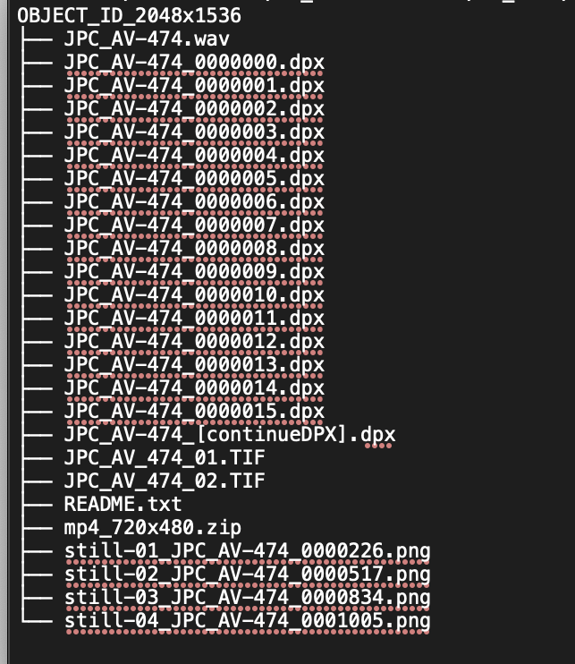

># NMAAHC RAWcooked Guidelines 

INTRODUCTION: General package structure for RAWcook-ing DPX film scans

>### This intro section describes general package structure for directories of DPX film scans and files designated to be attachements in the Matroska container created via RAWcooked. 
>#### Tags will be discussed later.  

 

The most general directory structure for DPX films scans and attachments is:

Structure

Files

- the top directory is Object_ID_resolution
	- this should be constructed at the time of scanning
	- the Object ID is the NMAAHC Object ID number
	- the resolution is the is the pixel resolution of the DPX scans
- the .wav file will exist if the film being scanned has an audio track
	- PCM/24/48
- the .dpx files are all the frames of the film that were scanned
	- NMAAHC naming structure:
		- OBJECT_ID_7digit.dpx
		- start with 0000000.dpx
		- e.g. 2012_79_1_16_1a_0000000.dpx
- the .TIF files are photos of the physical object
- README.txt
	- notes
	- need to structure this
	- current "my name is Crystal and when I was making these DPX I was thinkng about the stars."
- .zip file is a SD .mp4 of the full film being scanned
	- this may not actually be an acceptable attachment
	- will discuss further with Jerome/Dave
	- should be made at time of scan
- still-01_JPC_AV-474_0000226.png
	- these are .dpx that were trasncoded into .png via Photoshop to be representative stills
	- make 3-4 per scan

Tags

| tag                       | value                                   | DAMS field                | Comments                                                          | 
| ------------------------- | ------                                  | ------------              | --------                                                          |
| TITLE                     | Twilight City                           | mkv_title                 | title as determined by technician at time of transfer  |SUB_TITLE         	    | A Journey to the Moon		      | mkv_sub_title             |Sub title of object
| _coding_history            | O=VHS, C=Color, S=Analog, VS= NTSC, F=24, A=4:3, R=640×480, T=Sony SVO-5800,  O=FFV1mkv, C=Color, V=Composite, S=Analog Stereo, F=24, A=4:3, W=10-bit, R=640×480, M=YUV422p10, T=Blackmagic UltraStudio 4K Mini SN123456, ffmpeg vrecord; in-house, O=FFV1mkv, W=10-bit, R640x480, MYUV422p10 N=Emily Nabasny  | mkv_coding_history                                                   | Coding history for tape digitization. Should we use the cumbersome FADGI lingo? |
| ENCODER		    | Lasergraphics Scanstation .08           | mkv_encoder    	
| ENCODER_SETTINGS          |                                         | mkv_encoder_settings      | A list of the settings used for encoding this item. No specific format.
| DIRECTOR		    | Blake McDowell                          | mkv_director              | Director of film
| DESCRIPTION               | In the 1980s a young journalist...      | mkv_content_description   | short content description created by technician at time of transfer |
| DATE_DIGITIZED            | 2023-08-07                              | MKV_date_digitized        | The time that the item was transferred to a digital medium. This is akin to the “IDIT” tag in [@?RIFF.tags
| CATALOG_NUMBER            | 2012.79.1.16.1a                         | mkv_catalog_number        | unit identifier |
| _alternate_identifier     | TR2019-63                               | mkv_alternate_indentifier | for your secret agent ID |
| FPS                       | 18fps                                   | mkv_fps                   | we do also put this in the DPX header... but does anyone anywhere ever look at those? |
| ORIGINAL_MEDIA_FORMAT     | 16mm                                    | mkv_originating_media_type| needs controlled vocab... PBCore... how to enforce? |
| _creator                  | Smithsonian NMAAHC                      | mkv_creator               | Entity responsible for creation of digital file |
| COPYRIGHT                 | Use required by copyright holder        | mkv_copyright 
| LICENSE		    | NMAAHC License                          | mkv_license 
|||||      
 

<?xml version="1.0"?>
<!-- <!DOCTYPE Tags SYSTEM "matroskatags.dtd"> -->
<Tags>
  <Tag>
    <Targets />
    <Simple>
      <Name>TITLE</Name>
      <String>Twilight City</String>
    </Simple>
  </Tag>
  <Tag>
    <Simple>
      <Name>CONTENT_DESCRIPTION</Name>
      <String>In the 1980s a young journalist... </String>
    </Simple>
    <Targets />
  </Tag>
  <Tag>
    <Simple>
      <Name>CODING_HISTORY</Name>
      <String>O=VHS, C=Color, S=Analog, VS= NTSC, F=24, A=4:3, R=640×480, T=Sony SVO-5800,  O=FFV1mkv, C=Color, V=Composite, S=Analog Stereo, F=24, A=4:3, W=10-bit, R=640×480, M=YUV422p10, T=Blackmagic UltraStudio 4K Mini SN123456, ffmpeg vrecord; in-house, O=FFV1mkv, W=10-bit, R640x480, MYUV422p10 N=Emily Nabasny</String>
    </Simple>
    <Targets />
  </Tag>
  <Tag>
    <Simple>
      <Name>ORIGINAL_MEDIA_TYPE</Name>
      <String>16mm</String>
    </Simple>
    <Targets />
  </Tag>
  <Tag>
    <Simple>
      <Name>CAMERA_MAKE_MODEL</Name>
      <String>Canon C300</String>
    </Simple>
    <Targets />
  </Tag>
</Tags>

