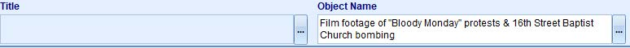
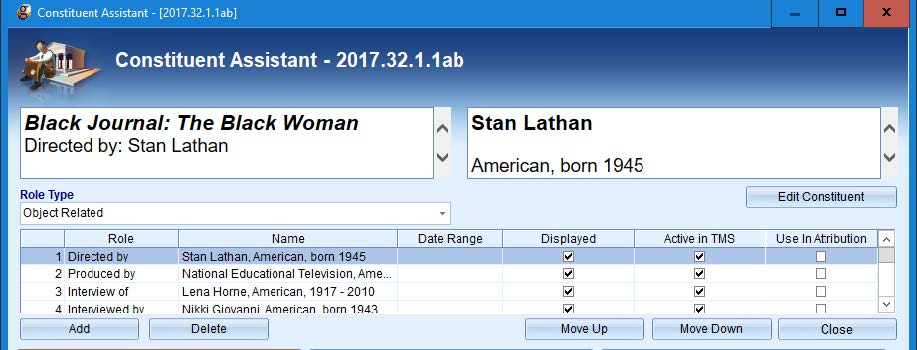

># NMAAHC Time-based Media Cataloging Guidelines
># **Moving Images**

 

Acknowledgements

   

>### These guidelines were written mostly between 2020-2023 by NMAAHC Media Cataloger, Bryan Miller. Review, edits and consultation were provided by Emily Houf, Bleakley McDowell and Judith Andrews. Addtional contributions have come from NMAAHC staff, contractors and interns. We are deeply inbedted to NMAAHC leadership and to many other museums and archives from which these guidelines find inspiration.

>> #### Contributors to these guidelines, past and present, include in alaphabetical order: Judith Andrews, Ina Archer, Jasmyn Castro, Chialin Chou, Walter Forsberg, Dan Finn, Emily Houf, AJ Lawrence, Bleakley McDowell, Bryan Miller, CK Ming, Emily Nabasny.

>>> ##### Apologies to anyone we missed! Send us your name!

 

Definition and Scope

>### These guidelines pertain to analog and digital moving image objects within the Collection of the National Museum of African American History and Culture (NMAAHC). They include the cataloging and naming of moving image objects, art installations with time-based elements, and digital objects and their carriers. Additional guidelines for Primary Digital Collection Objects (PDCO) can be found in the Guidelines for Cataloging PDCO. These guidelines build upon and should be used in conjunction with the general cataloging rules enumerated in the NMAAHC Cataloging Standards and Guidelines.

 

>### **Work and Instantiation** 
 Cataloging time-based materials addresses an object on two levels: (1) the physical object and (2) its content. The terms “work” and “instantiation” are frequently used to describe the difference between the physical object and its content and are defined as follows:

- Workthe content on a reel of film, videotape, cassette tape, DVD, digital file, etc.
 

- Instantiation: the format that carries the work (i.e., content); meaning, the physical manifestation/iteration on which the work can be found (e.g., 16mm film, 8mm film, videotape, DVD, etc.)
 

The Museum’s collection often contains the same work on multiple instantiations with different formats and physical characteristics. For example, the Pearl Bowser film collection holds multiple copies of the film Hands of Inge created when the film was made around 1962: work prints, release prints, negatives, answer prints, etc. Comprehensively cataloging Hands of Inge requires accounting for the differences between each of these instantiations as well as describing their content.

 

Pre-cataloging Preparation

One of the first steps in the cataloging process is the retrieval and evaluation of associated materials for the object(s) being cataloged. Below are some steps catalogers can take to prepare for detailed cataloging.

 

1. Check the accession file for background information about the object(s) being cataloged. The acquisition accession form is especially useful for providing pertinent information about the object's content, maker, and significance.
2. Check the conservation report for information about the object’s physical properties. For example, film stock, format, dimensions, information recorded on the container etc.
3. Check reference images for information that can be gleaned such as whether there is an optical soundtrack and whether the picture is in black-and-white or color. Similarly, reference images of film often include title slides that contain information that can be useful during preliminary cataloging.
4. Consult with the Media Archives & Conservation Team, Media Archivist, DAMS Manager and/or Collections Information Specialist to obtain access copies of the work and communicate any questions/concerns that arise. Confer with the registrars and Curator of Record for any questions about acquisition or context.

 

Item-level records vs. Components

Depending on the type of instantiation and the particularities of the collection in which it was acquired, cataloging may utilize separate TMS object records for each instantiation or combine several instantiations from the same accession into a single TMS object record using components. Instantiations from different accessions should always receive separate TMS records to properly record the acquisition information for each. With either approach, be sure to record the differences between the instantiations (format, attributes, dimensions, etc.) thoroughly so that users can distinguish them from one another easily. Consult with the Media Archivist, Collections Information Specialist and/or Registrars if unsure when instantiations should receive separate TMS records

 

 

##### **HANDS OF INGE (2012.79.1.9.1ac-.2a)**: in the example above, a work print and a release print of HANDS OF INGE were accessioned and are cataloged in separate TMS records. The title refers to the work and is the same in both records, while the object name field distinguishes the release print from the work print. Across both records, information about the work will remain the same, but details of the physical characteristics of the different instantiations will vary.

 

Determining Moving Image Works or Content

When possible, viewing the content in part or in its entirety is beneficial for cataloging. If the object has been digitized by NMAAHC, its content may be available through the Digital Asset Management System (DAMS), or via the DAMS Manager or Media Archivist. The NMAAHC film collection includes commercial releases in addition to rare and unique works, which may be available through external sources such as YouTube, Internet Archive, or the American Archive of Public Broadcasting.

Film databases such as Turner Classic Movies (TCM), the Internet Movie Database (IMDb), Internet Archive, American Film Institute (AFI), library databases and other reputable sources are all useful reservoirs of information, as are Media Archives and Conservation Team members and reference library. Survey several sources to get a comprehensive account of the work. Please note that when record of a work cannot be found in external sources, that rare work requires more detailed and comprehensive cataloging description than widely known commercial works.

When a work is not viewable and the content cannot be determined, complete the catalog record as thoroughly as possible based on the information that is currently known about the object. Be clear about what is ambiguous or unknown about the work. For example, an unviewable work may be cataloged as “16mm film of unknown footage attributed to Pearl Bowser,” or “Reel of unknown footage from the Pearl Bowser collection.” This communicates clearly what is both known and unknown about the instantiation and the unknown content. The catalog record can be updated when the object becomes viewable or more information is known.
 

<blockquote>

Types of Works

For cataloging purposes, it may be helpful to think of moving images in terms of a few broad conceptual groups such as formal works and informal works, finished works and unfinished works, fiction and nonfiction works, etc. We will refer to these as “Types of Works” for the purposes of this document. While the Types of Works are not official categories, the types can assist with determining titles/object names, which dates should be reflected in the TMS record, how to construct descriptions, which constituent role types to use, etc.

- Formal works: includes complete works that have been published or officially released with title, or for which a title is provided within the work itself or by the creator. Formal works are more likely to be prolific/pervasive in the public than informal works
    - e.g., feature films, televised programs, documentaries, etc.
- Informal works: refers to works that have not been officially published or released. In many instances, informal works were never assigned a formal title by their creators and are rare/not generally available in the public
    - e.g., home movies, amateur films, footage that have not been published, unfinished works by filmmakers
- Fiction works: refers to works that describe imaginary events and people
    - e.g., fictional movies and episodes of fictional television shows
- Nonfiction works: works that are based on facts, real events, and real people. They tend to be biographical or historical in nature
    - e.g., documentary films, filmed/televised interviews, filmed/televised sporting events, time-based artworks
- Unfinished works: works that have been deemed incomplete
    - e.g., unfinished film projects

Keep in mind that Types of Works are not strict categories, and some works may bridge multiple types. For example, the film Unspoken Conversation bears hallmarks of both informal and formal works. Filmmaker Iman Hameen created Unspoken Conversation while she was a student (informal), though it is a titled work and has since had a small commercial release (formal). When cataloging works that do not fit neatly into one category, use your best judgement when determining how these work type categories may guide cataloging decisions.

</blockquote>

 

Numbering Moving Image Works

Numbering guidelines for moving image objects combine the needs of NMAAHC’s Media Archives & Conservation Team and the numbering schema set forth by the Registrars. Given the variety of possible scenarios and the possible complexity of moving image objects, it is not practical to outline all scenarios in this document. Catalogers should consult the Media Archivist and/or Collections Information Specialist when uncertain about what numbering is most appropriate.

 

<blockquote>

Numbering PDCO

Numbering moving image PDCO conforms closely to numbering other forms of PDCO within the Collection, where the accession year and collection number are combined to generate an object number. A work number may be added to the sequence if there are multiple objects in the collection. The most general formulation for numbering moving image PDCO is:
 

*[AccessionYear].[CollectionNumber].[WorkNumber]*

-   **Accession Year** = the year in which the collection was accessioned
-   **Collection Number** = the order in which the collection was accessioned in that accession year
-   **Work Number** = the work (or object) number in the accessioned collection

<blockquote>

Storage Media

If the PDCO arrived via storage media that was not accessioned but is stored and tracked (e.g., DVD, flash drive, hard drive etc.), the storage media should be added as an Accessory Component to the first object in the accession that is contained on the storage media. This accessory is tracked in the Components module and the accessory should receive Component Numbers with suffixes such as _acc1, _acc2, _acc3, etc.

 

| Object Type | Object Number | Object Name/Title | Comments
| --- | --- | --- | --- |
| Digital Video | 2021.14 | Shade Compositions SFMOMA! | Single digital video file with no other objects in the accession |
| Digital video | 2021.49.1 | This Isn’t Working | Single digital video file with other objects in the accession |
| Digital video | 2018.55 | Question Bridge: Black Males | Single channel video with box of media players. Media players are accessories and receive the following Component Number 2018.55_acc1 |

</blockquote>

 

<blockquote>

Numbering Analog Objects

For analog moving image objects, the character ‘a’ should be used to designate the first ‘carrier’ for the essence or signal (film, video, DVD, etc.). Subsequent characters (‘b,’ ‘c,’ ‘d’ etc.) should be used for any remaining ‘carriers’ in the instantiation. The most general formulation for numbering a single- component analog object is:

 

*[AccessionYear].[CollectionNumber].[WorkNumber]. [InstantiationNumber] [ComponentElement]*

- Accession Year = the year in which the collection was accessioned
- Collection Number = the order in which the collection was accessioned in that accession year
- Work Number = the work (or object) number in the accessioned collection
- Instantiation Number = a number for the instantiation of a work (or object). Instantiation numbers are only used when there are multiple instantiations of a work in a collection.
- Component Element = a letter for each physical component of the object. This should start with ‘a’, for the first film and each additional film in the instantiation would receive a subsequent letter

 

| Object Type | Object Number | Object Name/Title | Comments
| --- | --- | --- | --- |
| Film | 2017.55.1.1a | Were You There?: The Black West | Object Number for a work that spans a single reel of acetate film (a) |
| Film | 2021.49.1 | No Maps On My Taps | Object Number for a work that spans two reels of film (a) & (b) |
| Film | 2018.55 | To Be Young, Gifted, And Black | SObject Number for a work that spans three reels of film (a), (b) & (c) |
| Videocassette |
| DVD |

</blockquote>

 

<blockquote>

Numbering Archival Collections

Archival collections, such as the Pearl Bowser archival collection (A2012.79), will also have a Series Number between the Collection Number and the Work Number. This number is used to indicate the type of media. Films in archival collections usually have 1 designated as the Series Number. The formulation would look like:

*[AccessionYear].[CollectionNumber].[SeriesNumber].[WorkNumber].[InstantiationNumber][ComponentElement]*

 

###### AFRICAN SPEAKERS (2012.79.1.2.1AB-.2AB): IN THE EXAMPLE ABOVE, TWO INSTANTIATIONS OF AFRICAN SPEAKERS WERE ACCESSIONED AS PART OF THE PEARL BOWSER ARCHIVAL COLLECTION: 2012.79.1.2.1AB AND 2019.79.1.2.2AB, A BLACK-AND-WHITE COMBINED NEGATIVE AND A POSITIVE BLACK-AND-WHITE. THE ACCESSION YEAR IS 2012, THE COLLECTION NUMBER IS 79, THE SERIES NUMBER IS 1, THE WORK NUMBER IS 2, THE INSTANTIATION NUMBERS ARE 1 AND 2 RESPECTIVELY AND THE COMPONENTS A & B REPRESENT EACH REEL OF ACETATE FILM.

</blockquote>

 

<blockquote>

Numbering Accessories

- #### Projection reels and film canisters
Projection reels, film cores, canisters and film laboratory paper ephemera are treated as Accessory Components to the film component which they accompany. Accessories are not accessioned objects and therefore receive suffixes such as _acc1, _acc2, _acc3 etc.

 

##### **LET THE CHURCH SAY AMEN! (2012.79.1.74.1ab)**: IN THE EXAMPLE ABOVE, THE WORK LET THE CHURCH SAY AMEN! IS SPREAD ACROSS TWO REELS OF FILM. THE FIRST REEL'S COMPONENT NUMBER IS 2012.79.1.74.1a AND THE SECOND REEL IS 2012.79.1.74.1b. THE PROJECTION REEL THE FIRST FILM IS ON IS 2012.79.1.74.1a_acc1 AND THE PROJECTION REEL THE SECOND REEL OF FILM IS ON IS 2012.79.1.74.1b_acc1. THE METAL CANISTERS HOLDING THE REELS ARE 2012.79.1.74.1a_acc2 AND 2012.79.1.74.1b_acc2, RESPECTIVELY. THE ORIGINAL SHIPPING CONTAINER THEY CAME IN IS 2012.79.1.74.1ab_acc1.

</blockquote>

 

See the NMAAHC_MediaCatalogingGuidelines_201610112 document for more about numbering moving image objects within the Collection.

 

Cataloging TMS Core Fields

<blockquote>

Classification

All film and video objects are cataloged with the classification Media Arts-Film and Video. For time-based media artwork, add the Visual Arts classification as well. For archival collections with time-based media, both the Archival Collection and Media Arts-Film and Video classifications should be used.

</blockquote>

 

<blockquote>

Object Names and Titles

<blockquote>

Formal works

Formal works include complete works that have been published or officially released with a title, or for which a title is provided within the work itself or by the creator. For these objects, enter the formal title in the Title field. Use the Object Name field in addition to the Title only for disambiguation, for example, if the collection has multiple instantiations of the same work.

###### **BOY! WHAT A GIRL (2015.167.1.1ab)**: IN THE EXAMPLE ABOVE, THE FILM’S OFFICIALLY RELEASED TITLE IS INCLUDED IN THE TITLE FIELD. AN OBJECT NAME, THOUGH OPTIONAL, IS NOT ASSIGNED.

 

<blockquote>

Clips or segments of formal works

When the object contains only a portion of a formal work, use the Object Name field with the formula “[Moving image format] clip from [Title of Work].” If the character limit allows, include more information about the subject of the clip: “[Carrier] clip of [subject] from [Title of Work].” Similarly, if the character limits are too restrictive, one can omit the carrier from the Object Name: “Clip of [long subject/Long Title of Work.]”

###### **FILM CLIP OF “SHEIK OF ARABY” FROM TIN PAN ALLEY (2015.275.29.1a)**: IN THE EXAMPLE ABOVE, ONLY A SCENE WHERE THE ACTORS PERFORM “SHEIK OF ARABY” IN THE FEATURE FILM TIN PAN ALLEY WAS ACCESSIONED. THE OBJECT NAME “FILM CLIP OF ‘SHEIK OF ARABY’ FROM TIN PAN ALLEY” IS GENERATED USING THE FORMULA ABOVE. THE TITLE FIELD IS LEFT BLANK.

 

Series of formal works

If a complete work is from a series/anthology, use the formula “[Series Title]: [Episode Title]” to generate a title for the Title field. The series title should also be entered in the Series/Portfolio field. An Object Name is not necessary unless it aids with disambiguation.

###### **CAMERA THREE: THE JAZZ OF WILBUR DE PARIS (2015.275.41.1a)**: IN THE EXAMPLE ABOVE, THE SERIES TITLE, CAMERA THREE, IS INCLUDED IN THE TITLE FIELD BEFORE THE COLON AND THE EPISODE TITLE APPEARS AFTER THE COLON WITHOUT QUOTES. THE SERIES TITLE IS ALSO INCLUDED IN THE PORTFOLIO/SERIES FIELD.

If only a portion of the work was accessioned, the Title field should be left blank, and an Object Name should be created using the formula for “Clips or segments for formal works” above. The series name should still be entered in the Series/Portfolio field.

###### **FILM CLIP FROM CAMERA THREE: OVER THE TOP TO BEBOP (2015.275.16.1a)**: IN THE EXAMPLE ABOVE, ONLY A SEGMENT OF AN EPISODE, “OVER THE TOP TO BEBOP,” FROM THE TELEVISION SERIES CAMERA THREE WAS ACCESSIONED. THE OBJECT NAME FILM CLIP FROM CAMERA THREE: OVER THE TOP TO BEBOP IS GENERATED USING THE FORMULA ABOVE, WHERE A COLON SEPARATES THE SERIES TITLE FROM THE EPISODE TITLE. THE SERIES TITLE IS INCLUDED IN THE PORTFOLIO/SERIES FIELD AS WELL.

 

Informal works: Home movies and amateur works

**Home movies** are films or videos made without professional equipment or expertise, usually of activities involving family and friends.

Films made without professional equipment or expertise but of activities not usually associated with home movies are generally considered **amateur works**.

Both home movies and amateur films are types of informal works and are cataloged similarly.

<blockquote>

Series of home movies and other informal works

Home movies are unique in that they often are compilations of various clips on one reel or tape, with multiple reels or tapes in a collection. These are not formal works, however, assigning descriptive object names is difficult given the variety of clips (vacation, birthdays, singing) and the sameness of overall topic (Holman family). For this reason, assigning a title for the overall collection with sequential numbering is helpful.

Collections or series of works that are not home movies but are also not formal works benefit from a similar titling structure for the same reasons.

###### **MAX BOND, SR. COLLECTION OF FAMILY HOME MOVIES (2016.16.1ab - .10abc)**: TITLES WITH SEQUENTIAL NUMBERS ARE ASSIGNED TO EACH RECORD.

###### **REVEREND S. S. JONES COLLECTION OF FAMILY HOME MOVIES (2011.79.1.1abc - .9abc)**: TITLES WITH SEQUENTIAL REEL NUMBERS ARE ASSIGNED TO THE COLLECTION.

 

Individual home movies, amateur films, and other informal works

If the home movie or informal work is not part of a series, create an object name using the formula "[Carrier] footage of [description of content]" or "Home movie footage of [description of content]."

###### **Film footage of “Bloody Monday” protests & 16th Street Baptist Church bombing (2012.79.1.107.1a)**

##### **HOME MOVIE OF HUNTS POINT CELEBRATION (2012.79.1.15.1a)**

 

Other types of works

<blockquote>

Compilation Reels

Sometimes, multiple intellectually unrelated works are spliced together on a single reel of film. For example, a film editor might create a demo reel containing multiple projects that they have worked on, like a portfolio. Similarly, a film enthusiast might splice scenes from several movies together on a single reel of film. If the spliced films are (1) complete works and (2) have formal titles, enter the formal titles in the Title field using a slash (/) to separate them and use the format “Compilation reel of [some unifying characteristic]” to generate an Object Name. However, if they are not complete works or do not all have formal titles, only add the Object Name.

###### **Film clips with the Benny Goodman Trio performing two songs (2015.275.17.1a)**: In the example above, two Benny Goodman Trio performances, “Nice Work If You Can Get It” and “Avalon” were spliced together on a single reel of film. The formal titles of the songs are entered in the Title field, separated by a slash and an Object Name that assists with disambiguation is added to the Object Name field.

 

###### **Compilation reel with clips from the Judy Garland Show (2015.275.46.1a)**: In the example above, clips from **The Judy Garland Show** (television series) and **The Judy Garland Show** (television special) were spliced together in a single reel of film. Neither consisted of complete works; therefore, the Title field is left blank.

</blockquote>
</blockquote>

 

<blockquote>

Constituents

There are two factors that typically influence how constituents should be linked to catalog records for moving images: (1) the type of constituent and (2) the Type of Work. There are two types of constituents, active constituents, and passive constituents, and four (4) broad Types of Works, formal and informal works; and fiction and nonfiction works, that will determine the role types that should be applied to constituents as well as the order in which they should appear.

An active/creator constituent related to the creation of the object should always be listed first. After the significant active/creator constituent(s) have been listed, continue with the remaining constituents, regardless of whether they had an active or passive role in the object’s creation. These constituents can be listed in order of significance, but this is not a strict rule. Constituents related to the object’s provenance are typically listed last.

The table below can help catalogers determine the correct role types to apply to constituents and the order in which they should appear. However, it is by no means exhaustive. Furthermore, as mentioned in earlier paragraphs, the distinction between Types of Works (especially formal and informal) is not always clearly defined. Similarly, formal works can be fictional or nonfiction and the same is true for informal works. Catalogers should consult with the Collections Information Specialist or the Media Archivist when uncertain about which role types might be most appropriate in a specific situation.

| Type of Work | Constituent Type | Role | Guidelines |
| --- | --- | --- | ------------------------------ |
| **Formal** feature films, television shows | **Active** directors, producers, editors, writers, interviewers, recording artists, composers | Directed by, Produced by, Edited by, Written by, Narrated by, Interviewed by, Recorded by, Composed by | List the director first for motion pictures or single television programs. For television series, it's sometimes more useful to list the producer or executive producer first. If a single individual has multiple roles in the creation of a formal work, it is sometimes useful to list several of these roles. If the soundtrack or score bears some significance, the recording artist(s) or composer(s) can be linked using the “Recorded by” or “Composed by” role types. |
| **Informal or Amateur** | **Active** amateur filmmakers, student filmmakers | Created by | Use the “Created by” constituent role type for nformal/amateur works or to indicate the individual(s) responsible for the work’s creation when more specific role types cannot be determined | 
| **Fictional Works** Fiction films, reenactments of historical events| **Passive** actors,portrayed individuals, institutions depicted | Subject of | For fiction works, use the role “Subject of” when entering actors/actresses featured. In these cases, the linked constituent record should show the actor’s given name (as opposed to the fiction character’s). In the Description field, one might include the fiction characters’ names in plot summaries/scene descriptions followed by the actors’ given name in parentheses. For reenactments of historical events, both the historical figure(s) portrayed, and the given name of the actor(s) should be listed using the “Subject of” role type. |
| **Nonfiction Works** Interviews, documentaries, video art | **Passive** Interviewees, portrayed individuals,institutions depicted |

 

###### **Black Journal: The Black Woman (2017.32.1.1ab)**: In the example above, an episode of an education television program (nonfiction, formal work), the active constituents are the director and producer and are listed first. The remaining constituents are listed afterwards, using roles typical for nonfiction works, such as “Interview of,” “Interview by,” and “Subject of.”
 

###### **CAB CALLOWAY HOME MOVIE #2 (2015.273.2.2.1abc)**: IN THE EXAMPLE ABOVE, A HOME MOVIE FILMED BY JAZZ MUSICIAN CAB CALLOWAY (NONFICTION, INFORMAL WORK), THE ACTIVE CONSTITUENTS ARE CAB AND NUFFIE CALLOWAY, WHO FILMED THE HOME MOVIE. THEY ARE LISTED FIRST USING THE “CREATED BY” CONSTITUENT ROLE TYPE. THE PASSIVE CONSTITUENTS ARE LISTED AFTERWARDS USING THE “SUBJECT OF” ROLE TYPE.

<blockquote>

Constituents for feature films

In addition to the guidelines above, adding constituents for some feature films poses a unique challenge for a few reasons. First, not all individuals featured in feature films are always officially credited; meaning, not everyone involved in the film’s creation is included in the credits or marketing material. Open-access databases, however, will sometimes include these individuals in their records. While including uncredited individuals is not typically recommended, if catalogers become aware that a prominent individual was not officially credited for a particular work but can confirm the veracity of their role in the work through multiple reputable sources, they may elect to include that constituent in the catalog record. For example, multiple sources confirm that Sidney Poitier made his debut appearance in the musical race film Sepia Cinderella (2015.167.17.1ab) as an uncredited extra. Although Poitier was not officially credited, his constituent record is linked to the object record for Sepia Cinderella. If, however, the veracity of an individual’s role is dubious, it is better to include the speculation in the Notes field without adding a constituent record.

The second challenge relates to the sheer number of people involved in the creation of some feature films. While the ultimate goal of cataloging aims to provide a comprehensive record of the objects in the Museum’s stewardship, creating constituent records for each person/institution involved in the production of a feature film is not always feasible. Furthermore, unlike open databases such as Discogs or Wikipedia, NMAAHC's film collection is curated; meaning, the records were accessioned because of their significance to the Museum’s collection and/or mission.

In light of these considerations, it is sometimes unnecessary to include all individuals/institutions credited in a film's creation in the TMS record. The film crew, with the exception of producers, directors and sometimes editors, is almost never included in the catalog record. While in many cases all the credited cast members are included in a TMS record, sometimes that is not practical. Catalogers should use their best judgement when determining which constituents to include/exclude. The following scenarios can help catalogers make this judgement call:
- Actors/actresses with top billing (i.e., lead actors/actresses) are typically included in the catalog record
- If a film won an award in a specific category, it could be useful to include the constituent(s) actively involved in that aspect of the film’s production
- Black/African American cast members officially credited in the film’s production are typically included in the catalog record
- Prominent individuals (whether credited or uncredited)

</blockquote>
</blockquote>

 

<blockquote>

Date

Use the release date for commercial productions and the date filmed/captured for informal works or those without a release date. Estimated date ranges are acceptable if the exact release date or date filmed is not known, following the standard date label format. If there are two dates of creation, for example a film was re-issued/re-released, enter the date of original release first followed by the re-release date.

##### **FILM CLIPS FROM THE DOCUMENTARY AMERICAN MUSIC - FROM FOLK TO JAZZ AND POP (2015.275.25.1a)**: IN THE EXAMPLE ABOVE, BOTH THE RELEASE DATE (1966) AND THE DATE THE DOCUMENTARY WAS REISSUED (1967) ARE INCLUDED IN THE DATE ASSISTANT.

</blockquote>

 

<blockquote>

Medium

Enter the material as enumerated in the Getty Art and Architecture Thesaurus (AAT).

| Object Type | Medium |
| --- | --- |
| film | acetate film, polyester film, or cellulose nitrate film |
| Videocassettes (VHS, Betacam, U-matic) | plastic with metal on polyester |
| DVD and optical discs | aluminum and polycarbonate |
| PDCO | Digital (entered into the Medium label manually) |

 

Reels and cans should only be included in the medium if they are accessioned Components. Do not include materials for Accessory reels and cans in the “Medium” field. Instead, they can be entered in the Physical Description field within the Components module if necessary.

</blockquote>

 

<blockquote>

Dimensions

For analog objects, include both the physical dimensions, as well as the work’s duration, correct to the second. The duration of the analog playback and the digital file might differ, as the analog film may include a leader (protective film that isn't screened) and a tail. If the duration being entered in TMS is the runtime associated with the digital file, catalogers should add a descriptive note specifying that the duration recorded is in fact for the digital file.

If there are multiple reels, enter the dimensions of each reel in the main Dimensions field, as opposed to the Dimensions field within the Components module.

The dimensions for film cans that are Accessory Components should be entered in the Components module.

For time-based PDCOs, the duration as well as file size should be entered. See the _Guidelines for Cataloging PDCO_ for more information.

> Dark Manhattan (2015.167.5.1abc)

Shade Compositions SFMOMA! (2021.14): A born-digital video artwork; both the duration and file size are entered in the Dimensions field.

</blockquote>

 

<blockquote>

Description

In the Description field, describe both the physical object and its content, to the extent that it is known. Begin with the physical properties of the object such as the medium, format, etc. This is especially important if there are multiple instantiations of the same work in the Collection. Anything that sets a particular instantiation apart from its siblings should be noted in the first paragraph of the Description, to clarify any ambiguities. State whether the picture is in black and white or color, if it is contained on one reel or multiple reels, if it is a silent film/contains sound, its genre, if it is an episode of a television show, etc. A film’s physical properties are often easily accessible by reviewing the conservation report. After the physical properties have been described, move on to the object’s content.

Descriptions of the content can be organized chronologically or thematically, depending on the work. While there is understandably a fair degree of interpretative work involved in describing/summarizing a work’s content, catalogers should avoid making assumptions or judgements about the content and should not include opinionated commentary on the content or its significance. For formal works that are well-known or widely available, a summary of the overall content suffices. Include more detailed descriptions for unique and rare works, even including a scene-by-scene outline if necessary. Descriptions should be written in full sentences using clear and concise language as well as a well-organized structure.

<blockquote>

Description when content is viewable and has been viewed

If the content is viewable, it is often helpful to begin with a description of the film’s title frame and/or opening scene. Continue by describing other important scenes, using timestamps, if possible, to identify the scene being described. Mention important individuals, landmarks, landscapes, etc. At the end, you can describe the final scene; or you might offer broad themes/subjects that arose, without necessarily giving a detailed description.

**History of Jazz with Willis Conover, (2015.275.10.1a)**: This footage hasn’t been found anywhere outside NMAAHC’s collection. Thus, a longer, more detailed description is provided.

**Black and Tan Fantasy (2015.275.10.1a)**: A race film that is widely known and available. Thus, the description is a relatively brief summary of the work.

 

Description when content is not viewable or has not been viewed

While it is often helpful to view the content of moving images firsthand, this is not always possible or practical. For example, the object has not been digitized and is otherwise inaccessible via other sources. In other instances, the object might be viewable but watching it in its entirety would be too time consuming and therefore impractical. In either of these cases, catalogers may rely on secondary sources to construct a description of the object's content. It is best to review multiple sources so that the description can be as comprehensive as possible. Secondary sources should not be cited in the Description field; however, catalogers should include a list of the secondary sources used in the Notes field or background information as Text Entries.

**History of the Negro in America (2017.55.24.1abc)**: Description and Notes for a film that has not been digitized and has not been viewed.

</blockquote>

 

<blockquote>

Attributes

<blockquote>

Object Type

As with all objects in the Collection, always use the most specific Object Type terms possible. Moving-image objects will typically have at least three Object Types that index the object’s physical properties:
- (1) the signal (film, video, DVD, PDCO etc.)
- (2) the color
- (3) whether there is sound

<blockquote>

Carrier or format

The carrier, or format, is typically indexed using one of the terms in the right column of the table below.

insert chart here

 

Color and Sound

All moving image objects should have attributes that indicate whether the image is in color or black-and-white and whether it is silent or contains sound. The appropriate terms, as they appear in TMS, are:
- color films (visual works)
- black-and-white films (visual works)
- sound films
- silent films

 

Additional Object Type Attributes

In addition to the object’s physical attributes, the following Object Types that refer to the content may also be added:
- children's films
- compilation films
- feature films
- home movies
- answer prints (motion pictures)
- release prints (motion pictures)
- work prints (motion pictures)
- short subjects

For film, it is not necessary to use “motion picture film” if a more specific object type within that branch can be used to describe the object. Other object types such as “negative” or “positive” can be used to further index and differentiate between objects, especially if there are different instantiations of the same work. However, while negative films should always include the “negative” Object Type, it is understood that a film is positive if neither the “negative” or “positive” Object Type is attached to the record.

Object Types should refer to the entire object rather than its constituent parts. For example, while motion picture films consist of “frames” and “filmstrips,” the “frames/filmstrips” Object Type should only be used when frames or filmstrips are being cataloged as isolated stills or strips, as opposed to parts of a motion picture work. Similarly, it would be redundant to use “sound tracks” if “sound films” is being used as an object type. “Sound tracks” should only be used if an optical/magnetic sound track is being cataloged as a distinct object.

##### **BOY WHAT A GIRL! (2015.167.1.1ab)**: IN THE EXAMPLE ABOVE, A RELEASE PRINT OF THE FEATURE FILM BOY WHAT A GIRL!, THE PHYSICAL PROPERTIES (16MM, BLACK-AND-WHITE, SOUND) AND CONTENT-RELATED PROPERTIES (FEATURE FILM, RELEASE PRINT) ARE ALL ADDED AS OBJECT TYPE ATTRIBUTES.

Subject Terms

Subject Terms for moving image objects follow the general NMAAHC Cataloging Standards and Guidelines. Additionally, genres can be input as subject terms. Some moving image genre terms include:

<blockquote>

Film

- **Animated films** - Films made using animation techniques, including the process of making still images appear to move, such as the technique of photographing drawings or objects in progressive stages of performing an action.
- **Artists’ films** - Films made by visual artists.
- **Blaxploitation films** - A film made with black performers and aimed at a black audience, though generally made by white producers. These films were especially popular in the early 1970s and took the form of nearly every established genre.
- **Documentary films** - Film genre that presents fact and real situations and people rather than fiction. They typically feature the people, places, and events who are the subjects of the film, rather than actors or sets. Early examples were influenced by television news and used portable cameras.
- **Experimental films** - Broadly describes a genre of motion pictures that explore new ways of dealing with a subject or that employ new and different production techniques or an unorthodox style of filmmaking.
- **Hollywood (Film)** - Films or objects relating to films produced by Hollywood studios or the Hollywood film industry.
- **Musical films** - Predominantly theatrical fiction works whose plot is structured around segments featuring combinations of music, song, and dance, including such various types as backstage, comedy, rock, and musical biographies.
- **Process films** - Documentaries or other forms of film that illustrate the processes by which something is made or done.
- **Independent films** - films made by black filmmakers or featuring black lead characters in which black artists have control over, or input into, the creative production of the film
- **Profile films** - Documentaries or other forms of film that profile an individual or individuals.
- **Race films** - Films featuring an African American cast and geared toward African American audiences that were produced outside Hollywood from about 1915 to about 1950
- **Western films** - A film genre since the earliest days of motion pictures that derives from the history and legends of the western part of this country, especially during the last half of the nineteenth century

Television

- Children’s television- Children's television are television programs designed for children, normally scheduled for broadcast during the morning and afternoon when children are awake.
- Public television- Television that provides cultural, informational, and instructional programs for the public and that is financed by a combination of government, private, and corporate sources, noncommercial television
- Sitcoms- A television series that involves a continuing cast of characters in a succession of comedic circumstances
- Variety shows (Television)- Entertainment made up of a variety of acts including musical performances, sketch comedy, magic, acrobatics, juggling, and ventriloquism. It is normally introduced by a compère (master of ceremonies) or host.

</blockquote>

 

<blockquote>

Portfolio/Series

Use this field for episodes within a larger series, e.g., Black Journal segments.
</blockquote>
</blockquote>

 

Components

<blockquote>

Film

For film, reels and cans should be listed as Accessory Components in the Components module. If the film is housed in multiple reels/cans, each should be listed as a separate Accessory in TMS. 

Primary Digital Component Objects (PDCO)

For PDCO, generic storage devices or playback equipment (such as USB flash drives) should be cataloged as Accessory Components. If these Accessories contain multiple works, the Accessory Component should be attached to the first record in the collection only. A Text Entry specifying which record contains the Accessory Component should be added to all other records associated with that Accessory. See the PDCO Cataloging Guidelines4 for more information. 

Physical Description

Pertinent information about Accessories and Components, such as medium. should be entered in the Physical Description field of the Components module. The Appendix contains a list of common terms the Media Conservation Team uses to describe film components. Catalogers should use the expanded versions of these terms as opposed to the abbreviations available in the Appendix. 

</blockquote>

 

Film Preservation Elements

Motion picture film is often made from various materials that deteriorate over time. To preserve the original object as faithfully as possible, new analog film preservation elements are created from the original film. Some of this preservation work is done internally by the Media Archives & Conservation Team, but most often it is outsourced to preservation labs. The product of the preservation process is referred to as a film “Preservation Element.”  

The Museum defines a film “Preservation Element” as a new analog film element that NMAAHC creates, exclusively through an outside vendor, after a film object has been accessioned. Occasionally, the Museum acquires archives or objects for accessioned or non-accessioned collections that are technically preservation elements, in the sense that they were created for a film’s preservation, but they were not created by the Museum or under contract from the Museum. These objects are not considered film “Preservation Elements” for cataloging even though they could be used in a new film preservation project. For TMS clarity the term film “Preservation Element” only applies to preservations that have been commissioned by NMAAHC post accession.

Preservation Elements are typically cataloged as Accessory Components of the accessioned film object instantiation component from which they were created.

<blockquote>

Other Types of Preservation Elements 

It should be noted that while the vast majority of NMAAHC’s Preservation Elements are film, there are a handful of objects on different signals (e.g., Betacam videotapes) that have been preserved as well. Cataloging Preservation Elements on other signals follows the same guidelines as cataloging film Preservation Elements; however, catalogers can consult with the Media Archivist with questions and concerns when cataloging non-film Preservation Elements.  

##### **CAB CALLOWAY HOME MOVIE #1 (2015.273.2.1.1A) AND PRESERVATION ELEMENTS**

</blockquote>

 

Adding Media links

In addition to still photographs/reference images, links to audiovisual material can be added to TMS. Video files are delivered from the DAMS to the MADS and then linked to TMS by following the steps below:
1. Create a Rendition Number using the naming convention below. The DAMS Unique Asset name can be retrieved from the DAMS, but the string (beginning with the underscore) must be manually created.
a. DAMS Unique Asset Name + _Video_001
2. Select “video” for the Medium Type
3. Select “Video File” for the Format
4. Select “MADS” for the Path
5. Create a unique Filename by using the naming convention below. The link in bold will always be the same, and the DAMS Unique Asset name will be identical to the one retrieved from DAMS. 
6. assets/player.html?name=https://mads.si.edu/NMAAHC/Collections/ + DAMS Unique Asset

 

Flex Fields

The Media Archives & Conservation Team uses a variety of Flex Fields to track aspects of the digitization process. In addition to tracking the digitization workflow for individual time-based objects, Flex Fields are also reportable via Advanced Searches; meaning, reports can be executed to track individual Flex Fields or a combination of multiple Flex Fields across the collection. This provides a systematic way of ensuring that some steps in the digitization process are directly traceable in TMS. Below is a list of Flex Fields the Media Archives & Conservation Team uses to track the Media Conservation Lab (MCL) Digitization Workflow, and a brief outline of their intended use.

 

Appendix A: Abbreviations

 

Appendix B: Additional Resources

- Museum Cataloging
     - Harpring, Patricia. “Cataloging Museum and Special Collections Works: Documentation, Indexing, Access with CDWA, CCO and the Getty Vocabularies.” Special Collections, 2019, 269.

    - Cataloging Museum and Special Collection Objects. https://www.getty.edu/research/tools/vocabularies/cco_cdwa_for_museums.pdf

 

- Film and Audiovisual Cataloging – Libraries and Archives
    - “Genre-Form Guide (Motion Picture and Television Reading Room, Library of Congress).” Accessed June 10, 2021. https://www.loc.gov/rr/mopic/migintro.html.
    - Harrison, Harriet, and FIAF Cataloguing Commission, eds. The FIAF Cataloguing Rules for Film Archives. Film, Television, Sound Archive Series, vol. 1. München; New York: K.G. Saur, 1991. https://www.fiafnet.org/images/tinyUpload/E-Resources/Commission-And-PIP-Resources/CDC-resources/FIAF_Cat_Rules.pdf
    - “IASA Publications | International Association of Sound and Audiovisual Archives.” Accessed June 2, 2021. https://www.iasa-web.org/iasa-publications.
    - UCLA Film & Television Archive Cataloging Procedure Manual http://old.cinema.ucla.edu/CPMVoyager/CPMV00TofC.html

 

- FRBR
    - Bloss, Marjorie E. “FRBR - A Refresher Course,” n.d., 25. FRBR - A refresher course (rda-jsc.org)
    - Documenting Media Art.” Accessed June 2, 2021. http://mattersinmediaart.org/assessing-time-based-media-art.html.
    - “Library Terminology Informally Explained - Semantic Web Standards.” Accessed June 10, 2021. https://www.w3.org/2001/sw/wiki/Library_terminology_informally_explained#expression_.28FRBR.29.
    - Tillett, Barbara. “A Conceptual Model for the Bibliographic Universe,” n.d., 8. https://www.loc.gov/cds/downloads/FRBR.PDF

 

- Time-Based Media Cataloging
    - “Documenting Media Art.” Accessed June 2, 2021. http://mattersinmediaart.org/assessing-time-based-media-art.html.
    - Gallery Systems. “The Imai Foundation | Cataloguing Time Based Media.” Gallery Systems, July 17, 2018. https://www.gallerysystems.com/inter-media-art-institute-catalogue-time-based-media/.
    - Griesinger, Peggy. “Process History Metadata for Time-Based Media Artworks at the Museum of Modern Art, New York” 4 (2016): 12. https://www.henrystewartpublications.com/sites/default/files/Griesinger.pdf
    - MonkEL. “Time-Based Media Art: Preserving Bits and Bytes.” Text, August 21, 2015. https://npg.si.edu/blog/time-based-media-art-preserving-bits-and-bytes.
    - “Time-Based Media & Digital Art | Time-Based Media & Digital Art.” Accessed June 10, 2021. https://www.si.edu/tbma/.